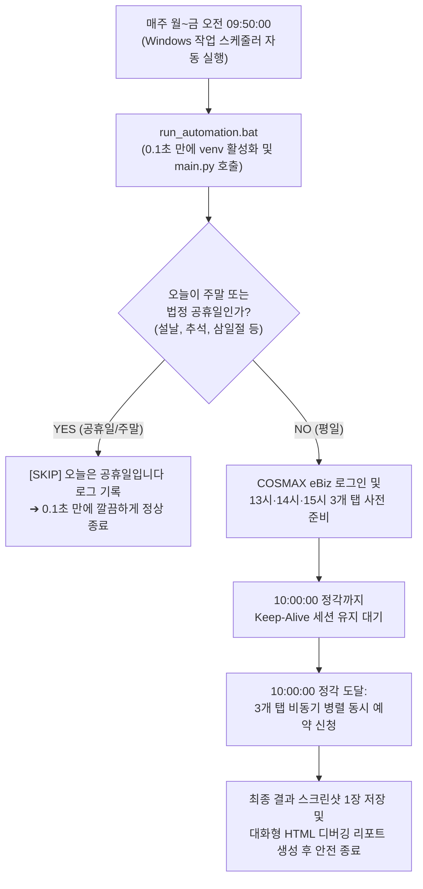

# COSMAX eBiz 고속 입고예약 자동화 프로그램

COSMAX eBiz (`https://ebiz.cosmax.com/`) 시스템에 자동 로그인하여 매일 오전 10시 정각, **일반품목 13시·14시·15시 3개 시간대를 0.1초 만에 비동기 병렬 동시 예약**하는 초고속 무인 자동화 시스템입니다.

**주말(토/일) 및 대한민국 법정 공휴일(대체공휴일 포함)에는 실행이 자동으로 건너뛰어집니다(SKIP).**

---

## 📚 상세 운영 및 기술 문서 (docs/)

실무 운영 및 상세 환경 설정을 위해 `docs/` 디렉토리에 전용 매뉴얼이 제공됩니다:

* 🪟 [**Windows PC 처음부터 시작하기 (상세 셋업 가이드)**](./docs/WINDOWS_SETUP_GUIDE.md) : 파이썬 미설치 PC 기준 A to Z 설치 및 초기 구성
* 📘 [**실무 운영 및 모니터링 매뉴얼**](./docs/OPERATIONS_GUIDE.md) : 매일 아침 운영 루틴, 리포트 판독법, 스케줄러 관리 및 전원 수칙
* 🛠️ [**장애 대응 및 트러블슈팅 가이드**](./docs/TROUBLESHOOTING.md) : 로그인 실패, 브라우저 오류, 10시 정각 슬롯 경쟁 실패 등 유형별 긴급 조치

---

## 🚀 Windows 컴퓨터에서 처음부터 시작하기 (초보자 가이드)

파이썬이나 개발 환경이 전혀 없는 **완전 새 윈도우 PC**에서도 아래 순서대로만 진행하면 5분 안에 세팅이 끝납니다.

### 1단계: Python 설치 (★가장 중요)
1. [Python 공식 다운로드 사이트](https://www.python.org/downloads/)에 접속하여 **Python 3.12** (또는 3.11) 설치 파일을 다운로드합니다.
2. 다운로드한 설치 파일(`python-3.12.x-amd64.exe`)을 실행합니다.
3. > [!CAUTION]
   > 설치 창 맨 아래에 있는 **`[✓] Add python.exe to PATH`** 체크박스를 반드시 체크해야 합니다!  
   > (체크하지 않으면 명령 프롬프트나 배치 파일에서 `python` 명령어를 찾지 못합니다.)
4. **`Install Now`** 버튼을 클릭하여 설치를 완료하고 닫습니다.

### 2단계: 프로그램 파일 준비 및 폴더 배치
* 한글이나 띄어쓰기가 없는 깔끔한 영문 경로를 권장합니다.
* 예시: **`C:\cip`** 폴더를 만들고, 다운로드받은 프로그램 파일 전체를 복사해 넣습니다.

### 3단계: 계정 정보 설정 (`setup_account.bat` 더블 클릭! ⭐)
* 비IT 사용자도 메모장으로 JSON을 수정할 필요 없이 마법사로 안전하게 설정할 수 있습니다.
1. `C:\cip\setup_account.bat` 파일을 마우스로 **더블 클릭**합니다.
2. 검은 창에 안내되는 질문에 따라 본인의 **eBiz 아이디와 비밀번호를 입력**하고 Enter를 누릅니다.
3. 자동으로 안전한 `config.json` 파일이 생성됩니다.
> [!TIP]
> **🔒 Git 보안 관리**: 실제 비밀번호가 적힌 `config.json`은 `.gitignore`에 등록되어 **Git에 절대 업로드되지 않습니다.** Git에는 비밀번호가 없는 템플릿 파일(`config.example.json`)만 공유되므로 팀원 간 안전하게 코드를 공유할 수 있습니다.

### 4단계: 최초 의존성 자동 설치 (원클릭)
1. `C:\cip\run_automation.bat` 파일을 마우스로 **더블 클릭**합니다.
2. 프로그램이 스스로 가상환경(`venv`)을 만들고 필수 패키지와 전용 Chromium 브라우저를 자동으로 설치합니다. (최초 1회만 약 1~2분 소요)

### 5단계: 화면 보면서 정상 작동 테스트 (리허설)
1. 키보드의 `Win + R`을 누르고 `cmd`를 입력하여 명령 프롬프트를 엽니다.
2. 아래 명령어를 복사하여 붙여넣고 실행합니다:
   ```cmd
   cd /d C:\cip
   run_automation.bat --headful --force
   ```
3. 브라우저가 화면에 뜨면서 로그인 및 3개 탭 오픈이 정상적으로 진행되는지 눈으로 확인합니다. (테스트가 끝나면 창을 닫습니다.)

### 6단계: 매일 평일 무인 자동 스케줄러 등록
1. `C:\cip\register_scheduler.bat` 파일을 찾습니다.
2. 마우스 우클릭 ➔ **[관리자 권한으로 실행]**을 클릭합니다.
3. `[성공] Windows 작업 스케줄러 등록이 완료되었습니다!` 문구가 뜨면 등록 완료입니다.
4. 이제 **매주 월~금 오전 09:50에 브라우저는 백그라운드로 돌면서 콘솔 창이 화면에 열려 실시간 진행 상황을 보여주고, 10시 예약 완료 후 60초 뒤 스스로 닫힙니다.**

### 7단계: 무인 PC 필수 설정 (절전 모드 해제)
* PC가 잠자기(Sleep)에 들어가면 스케줄러가 켜지지 못할 수 있습니다.
* `Windows 설정` ➔ `시스템` ➔ `전원` ➔ **절전 모드(PC를 절전 상태로 전환)를 `해당 없음(안 함)`**으로 설정하세요. (화면 끄기는 상관없습니다.)

---

## ⚡ 주요 핵심 기능

1. **단일 로그인 세션 기반 3개 탭 비동기 병렬 예약 (`asyncio.gather`)**:
   * 동일 계정(`S102190`)의 중복 로그인 차단(세션 튕김)을 원천 방지하기 위해 1회 로그인 세션(BrowserContext)을 공유.
   * 13시, 14시, 15시 전담 탭 3개가 10:00:00 정각에 **0.1초의 지연도 없이 동시에 서버로 예약 신청을 제출**.
2. **10시 정각 Fail-Safe 마이크로 재조회 루프 (방안 B)**:
   * 전체 새로고침(F5) 대신 **[지류]청북2층 라디오 버튼 재클릭(가벼운 AJAX 그리드 갱신)**을 통해 0.05초 만에 최신 체크박스를 갱신.
   * 0.3초 간격 최대 5회(총 1.5초) 감지하며, **체크박스 발견 즉시 0.00초 만에 클릭하고 루프를 즉시 탈출(Break)**하여 불필요한 지연 방지.
3. **원스톱 JS 브라우저 내부 배치 격발**:
   * 모달 오픈 ➔ 자재 추가 ➔ 납품허용 'O' 품목 3개 선택 ➔ 팔레트(1)/차량(1) 입력 ➔ 저장까지 Playwright 브라우저 내부 단일 JavaScript 평가로 0.05초 만에 처리.
4. **일자별 정예화 결과물 (`logs/YYYYMMDD/`)**:
   * 날짜별 폴더 하나 안에 **실행 로그(`.log`) + 대화형 웹 리포트(`.html`) + 최종 결과 스크린샷 1장(`.png`)** 딱 3개만 보존.
5. **Windows 작업 스케줄러 원클릭 등록/해제**:
   * `register_scheduler.bat` / `unregister_scheduler.bat` 마우스 우클릭 관리자 실행 지원.
6. **10시 정각 이전 무인 자동 복구(Auto-Healing) 2중 방어선**:
   * **1차 (Python)**: 09:50~10:00 사이 일시적 네트워크 순단/오류 발생 시 5초 후 세션 자동 재접속 및 3개 탭 재준비 (최대 5회).
   * **2차 (Windows)**: 스케줄러에 [실패 시 1분 간격 3회 자동 재시작] 및 [컴퓨터를 깨워 실행] 기본 자동 주입.

---

## 📁 프로젝트 구조

```text
cip/
├── docs/                         # 상세 운영 및 기술 문서
│   ├── WINDOWS_SETUP_GUIDE.md    # Windows PC 신규 설치 및 환경 구축 상세 가이드
│   ├── OPERATIONS_GUIDE.md       # 실무자/관리자를 위한 일일 운영 및 모니터링 매뉴얼
│   └── TROUBLESHOOTING.md        # 장애 상황별 원인 분석 및 긴급 조치 매뉴얼
├── src/
│   ├── browser.py                # Playwright 브라우저 제어 및 3개 탭 비동기 병렬 예약 핵심 엔진
│   ├── config.py                 # 설정 파일(config.json) 로드 및 검증 모듈
│   ├── holiday.py                # 주말 및 대한민국 공휴일/대체공휴일 자동 판별 모듈
│   ├── logger.py                 # 초고속 메모리 버퍼 로깅 및 반응형 HTML 디버깅 리포트 생성기
│   └── setup_account.py          # 비IT 사용자용 터미널 계정 설정 마법사
├── logs/                         # 일자별 실행 결과물 저장 디렉토리
│   └── 20260911/
│         ├── auto_login_20260911.log     # 실시간 타임스탬프 상세 실행 로그
│         ├── auto_login_20260911.html    # 로그 레벨 필터링 및 스크린샷 확대 지원 HTML 리포트
│         └── reservation_20260911.png    # 최종 결과 스크린샷 단 1장 (성공 또는 실패 지점)
├── setup_account.bat             # 비IT 사용자용 계정(아이디/비번) 설정 원클릭 마법사
├── config.example.json           # Git 업로드용 계정 설정 템플릿 (보안 보호)
├── config.json                   # [로컬 전용] 실제 계정 정보 파일 (.gitignore 대상)
├── main.py                       # 자동화 진입점 및 라이프사이클 오케스트레이터
├── register_scheduler.bat        # Windows 작업 스케줄러 원클릭 자동 등록 스크립트
├── unregister_scheduler.bat      # Windows 작업 스케줄러 원클릭 등록 해제 스크립트
├── run_automation.bat            # Windows 환경 실행 배치 파일 (venv 가속 및 무인 모드 지원)
├── run_automation.sh             # Mac/Linux 환경 실행 쉘 스크립트
└── requirements.txt              # Python 필수 패키지 (playwright, holidays)
```

---

## ⏰ Windows 무인 자동화 동작 라이프사이클



---

## ⚙️ `config.json` 설정 가이드

```json
{
  "url": "https://ebiz.cosmax.com/login/loginForm.do",
  "reservation_url": "https://ebiz.cosmax.com/inreservationReg/inreservationRegListNew.do?gblCompid=1200&TMENU=M00003&LMENU=M00084",
  "user_id": "S102190",
  "user_pw": "90801277**//123",
  "target_hours": [13, 14, 15],
  "target_time": "10:00:00",
  "keep_alive_interval_seconds": 30,
  "grid_max_retries": 5,
  "grid_retry_delay_seconds": 0.3,
  "headless": false,
  "skip_weekends": true,
  "skip_holidays": true,
  "custom_holidays": []
}
```

| 설정 키 | 기본값 | 설명 |
| :--- | :---: | :--- |
| `user_id` | `"S102190"` | COSMAX eBiz 로그인 사용자 계정 |
| `user_pw` | - | 사용자 비밀번호 |
| `target_hours` | `[13, 14, 15]` | 동시 예약 대상 시간대 목록 (일반품목 13시, 14시, 15시) |
| `target_time` | `"10:00:00"` | 서버 슬롯 오픈 목표 시각 |
| `grid_max_retries` | `5` | 10시 정각 시계 오차 대비 그리드 재조회 최대 횟수 (총 1.5초) |
| `grid_retry_delay_seconds` | `0.3` | 그리드 재조회 간격 (초 단위) |
| `keep_alive_interval_seconds` | `30` | 10시 정각까지 세션 유지 핑 전송 주기 |
| `skip_weekends` | `true` | `true` 시 토요일/일요일 자동 SKIP |
| `skip_holidays` | `true` | `true` 시 대한민국 법정 공휴일/대체공휴일 자동 SKIP |
| `custom_holidays` | `[]` | 회사 창립일 등 추가 휴일 지정 (예: `["2026-09-25"]`) |
| `headless` | `false` | 브라우저 창 표시 여부 (`true` 시 백그라운드 실행) |

---

## 🔍 실행 결과 및 로그 디버깅

매일 실행 후 `logs/YYYYMMDD/` 폴더에 3종의 결과 파일이 생성됩니다:

1. **`auto_login_YYYYMMDD.html` (강력 추천)**:
   * 더블 클릭하여 크롬/엣지 브라우저에서 바로 확인하는 시각화 리포트.
   * `INFO`, `WARNING`, `ERROR` 로그 레벨 필터링 및 실시간 검색 지원.
   * 우측 상단 스크린샷 썸네일 클릭 시 고해상도 확대 모달 지원.
2. **`reservation_YYYYMMDD.png`**:
   * 예약 성공 또는 실패 시점의 최종 브라우저 화면 캡처본 (일자별 1장 보존).
3. **`auto_login_YYYYMMDD.log`**:
   * 각 탭별 밀리초 단위 세부 실행 타임라인 및 네트워크 로그.

---

## 💻 Mac / Linux (개발 환경) 실행 방법

```bash
cd /Users/user/Git/cip

# 1. 가상환경 활성화 및 의존성 설치 (최초 1회)
source venv/bin/activate
pip install -r requirements.txt
playwright install chromium

# 2. 브라우저 화면을 보면서 테스트 실행 (Headful)
./run_automation.sh --headful

# 3. 주말/공휴일에도 강제로 테스트 실행 (--force)
./run_automation.sh --headful --force

# 4. 백그라운드(Headless) 무인 모드 실행
./run_automation.sh --headless
```
