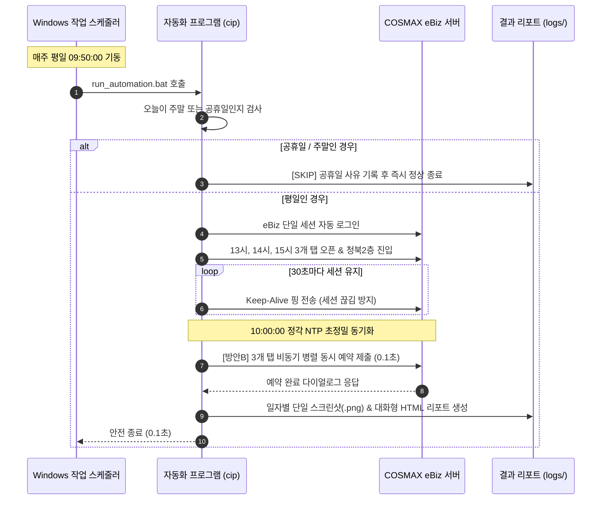

# 📘 COSMAX eBiz 입고예약 자동화 시스템 운영 매뉴얼

이 문서는 COSMAX eBiz 고속 입고예약 시스템의 일상 운영, 모니터링, 결과 검증, 설정 변경 및 스케줄러 유지보수를 위한 **실무 운영 매뉴얼**입니다.

---

## 📋 목차
1. [일일 운영 라이프사이클 (Daily Routine)](#1-일일-운영-라이프사이클-daily-routine)
2. [실행 결과 확인 및 리포트 판독법](#2-실행-결과-확인-및-리포트-판독법)
3. [Windows 작업 스케줄러 관리](#3-windows-작업-스케줄러-관리)
4. [무인 운영 PC 환경 관리 수칙](#4-무인-운영-pc-환경-관리-수칙)
5. [환경 설정(config.json) 변경 가이드](#5-환경-설정configjson-변경-가이드)
6. [긴급 상황 시 수동 대응 절차](#6-긴급-상황-시-수동-대응-절차)

---

## 1. 일일 운영 라이프사이클 (Daily Routine)

본 프로그램은 매주 월~금(평일) 오전 09:50에 스스로 기동하여 10:00 예약 완료 시까지 무인으로 동작합니다.



### ⏰ 타임라인별 운영 체크포인트

| 시각 | 시스템 동작 | 운영자 확인 권장 사항 |
| :--- | :--- | :--- |
| **09:50** | 작업 스케줄러가 **콘솔 창을 화면에 띄우며** 자동 기동 | 모니터에 검은색 콘솔 창이 열리며 실시간 진행 상황 출력 시작 |
| **09:51 ~ 09:59** | eBiz 로그인 완료 및 3개 탭에서 10시 정각 대기 | 콘솔 창에서 30초마다 남은 시간 카운트다운 Ping 확인 |
| **10:00:00** | 10시 정각 동시 0.1초 비동기 예약 신청 격발 | 콘솔 창에서 13시, 14시, 15시 실시간 성공 메시지 확인 |
| **10:00:10** | 예약 완료 출력 및 60초 카운트다운 후 창 자동 닫힘 | 결과 확인 후 엔터 누르거나 그대로 두면 60초 뒤 자동 닫힘 |

> [!TIP]
> **🛡️ 10시 정각 이전 자동 복구(Auto-Healing) 2중 안전장치 탑재:**
> 1. **1차 방어선 (`main.py`)**: 09:50~10:00 사이 인터넷 일시 순단이나 세션 끊김 오류 발생 시, 프로그램을 끄지 않고 **5초 뒤 브라우저를 다시 띄워 자동으로 재로그인 및 3개 탭을 재준비**합니다. (최대 5회 자동 재시도)
> 2. **2차 방어선 (`register_scheduler.bat`)**: 프로그램 프로세스 자체가 강제 종료되더라도, 윈도우 스케줄러가 **1분 뒤 최대 3회 자동으로 다시 실행**하도록 구성되어 있습니다.

---

## 2. 실행 결과 확인 및 리포트 판독법

실행이 끝나면 프로그램 루트의 `logs/` 디렉토리에 **실행 당일 날짜 폴더(`YYYYMMDD`)**가 생성되며, 결과 파일 딱 3개만 보존됩니다.

```text
logs/
└── 20260911/
    ├── auto_login_20260911.html   # 1. 시각화 대화형 리포트 (웹 브라우저로 확인)
    ├── auto_login_20260911.log    # 2. 실시간 타임스탬프 상세 텍스트 로그
    └── reservation_20260911.png   # 3. 최종 결과 단일 스크린샷 (성공/실패 화면)
```

### ① 대화형 HTML 리포트 (`auto_login_YYYYMMDD.html`)
가장 직관적으로 결과를 확인할 수 있는 파일입니다. 더블 클릭하여 크롬이나 엣지 브라우저로 열면 됩니다.

- **상단 요약 배너**: 최종 결과(`SUCCESS` / `FAILED`), 총 소요 시간, 예약 성공 시간대 표시
- **필터링 버튼**: `ALL`, `INFO`, `WARNING`, `ERROR` 버튼을 클릭하여 원하는 레벨의 로그만 필터링
- **실시간 검색**: 특정 키워드(예: `13`, `오류`, `클릭`)로 로그 검색 가능
- **스크린샷 썸네일 & 확대**: 리포트 우측 상단의 스크린샷 썸네일을 클릭하면 원본 고해상도로 확대되어 예약 내역을 즉시 확인할 수 있습니다.

### ② 최종 스크린샷 (`reservation_YYYYMMDD.png`)
- **성공 시**: 입고예약 목록에 오늘 신청한 13시, 14시, 15시 예약 건이 등록된 상태의 화면이 캡처되어 있습니다.
- **실패 시**: 실패가 발생한 순간의 화면(예: 모달 팝업의 오류 문구 또는 미노출 화면)이 캡처되어 원인 파악에 바로 활용할 수 있습니다.

### ③ 텍스트 로그 (`auto_login_YYYYMMDD.log`)
정밀한 타임스탬프(밀리초 단위)가 필요한 경우 메모장으로 열어 확인합니다.
- `[INFO] ⚡ [Trigger 10:00:00] 10시 정각 도달! 3개 탭 동시 예약 실행...`
- `[INFO] ✅ [13시] 예약 완료 성공 (소요: 0.18초)`
- `[INFO] ✅ [14시] 예약 완료 성공 (소요: 0.21초)`
- `[INFO] ✅ [15시] 예약 완료 성공 (소요: 0.20초)`

---

## 3. Windows 작업 스케줄러 관리

### ① 작업 상태 및 최근 실행 결과 확인
1. `Win + R` ➔ `taskschd.msc` 입력 후 Enter를 누릅니다.
2. 왼쪽 트리에서 **`작업 스케줄러 라이브러리`**를 선택합니다.
3. 목록 가운데 **`CosmaxAutoReservation`** 작업을 찾습니다.
4. 확인할 주요 항목:
   - **상태**: `준비 완료` (정상 대기 중)
   - **다음 실행 시간**: 다음 평일 `오전 09:50:00`
   - **마지막 실행 결과**: `0x0` 또는 `작업이 성공적으로 완료되었습니다.` (정상)

### ② 즉시 수동 실행 테스트
10시 이전이라도 스케줄러가 정상적으로 배치 파일을 호출하는지 테스트하고 싶다면:
- `CosmaxAutoReservation` 작업을 마우스 우클릭 ➔ **[실행]**을 클릭합니다.
- 작업이 시작되고 잠시 후 `logs\` 폴더에 로그가 기록됩니다.

### ③ 실행 시간 변경 방법 (예: 09:40으로 변경)
1. `CosmaxAutoReservation` 작업을 더블 클릭하여 속성 창을 엽니다.
2. **`트리거`** 탭 ➔ 등록된 일정을 선택하고 **[편집]**을 누릅니다.
3. **시작 시간**을 원하는 시간(예: `09:40:00`)으로 변경하고 [확인]을 누릅니다.

### ④ 스케줄러 등록 해제
더 이상 자동 예약을 실행하지 않으려면:
- `unregister_scheduler.bat` 파일을 마우스 우클릭 ➔ **[관리자 권한으로 실행]**하면 즉시 깔끔하게 삭제됩니다.

---

## 4. 무인 운영 PC 환경 관리 수칙

무인으로 매일 아침 자동 실행되는 PC는 다음 세 가지 조건이 반드시 지켜져야 합니다:

### ① PC 절전 모드(Sleep) 원천 차단
- PC 본체가 절전 모드에 들어가면 네트워크 카드가 꺼지거나 CPU가 멈춰 스케줄러가 정상 동작하지 못합니다.
- **설정**: `Windows 설정` ➔ `시스템` ➔ `전원 및 배터리` ➔ `화면 및 절전` ➔ **절전 모드: `해당 없음`**

### ② Windows 자동 업데이트로 인한 새벽 재부팅 대비
- 윈도우 업데이트가 새벽에 자동으로 PC를 재부팅하면 사용자가 로그인하지 않아 작업이 실행되지 않을 수 있습니다.
- **대응책**:
  1. `Windows 업데이트` ➔ `고급 옵션` ➔ `사용 시간(Active Hours)`을 `오전 08:00 ~ 오후 18:00`로 설정합니다.
  2. 스케줄러 속성의 `일반` 탭에서 **`[✓] 사용자의 로그온 여부와 관계없이 실행`** 옵션을 활성화해 둘 수 있습니다. (이 경우 Windows 사용자 계정 암호 입력 필요)

### ③ 네트워크 안정성 유지
- 무선 Wi-Fi보다는 가급적 **유선 LAN선** 연결을 강력히 권장합니다.
- 회사 사내망의 경우 아침 시간에 프록시 또는 인증 페이지가 뜨는지 확인합니다.

---

## 5. 환경 설정(config.json) 변경 가이드

### ① 계정 정보(아이디/비밀번호) 변경 시
비밀번호가 주기적으로 변경되거나 계정이 바뀌었을 때는 **`setup_account.bat`을 더블 클릭**하여 입력하시면 JSON 문법 실수 없이 안전하게 변경됩니다. (메모장으로 직접 수정하셔도 무방합니다.)

> [!IMPORTANT]
> **🔒 Git 업로드 시 보안 수칙**
> - 실제 비밀번호가 저장되는 **`config.json`은 `.gitignore`에 등록되어 있어 Git에 커밋/푸시되지 않습니다.**
> - 저장소에는 템플릿 파일인 **`config.example.json`**만 공유되므로 팀원 간 코드를 안심하고 공유할 수 있습니다.

### ② 설정 파라미터 상세 안내
시간대나 재시도 횟수 등을 변경하려면 `config.json` 파일을 열어 수정합니다:

```json
{
  "url": "https://ebiz.cosmax.com/login/loginForm.do",
  "reservation_url": "https://ebiz.cosmax.com/inreservationReg/inreservationRegListNew.do?gblCompid=1200&TMENU=M00003&LMENU=M00084",
  "user_id": "S102190",
  "user_pw": "90801277**//123",
  "target_hours": [13, 14, 15],
  "target_time": "10:00:00",
  "keep_alive_interval_seconds": 30,
  "grid_max_retries": 5,
  "grid_retry_delay_seconds": 0.3,
  "headless": false,
  "skip_weekends": true,
  "skip_holidays": true,
  "custom_holidays": []
}
```

| 설정 키 | 기본값 | 설명 및 변경 시 주의사항 |
| :--- | :---: | :--- |
| `user_pw` | - | COSMAX eBiz 계정 비밀번호가 주기적으로 변경될 때 이 값을 업데이트하세요 (`setup_account.bat` 추천). |
| `target_hours` | `[13, 14, 15]` | 예약할 시간대입니다. 만약 14시와 15시만 예약하고 싶다면 `[14, 15]`로 변경하면 됩니다. |
| `custom_holidays` | `[]` | 법정 공휴일 외에 **회사 창립기념일, 노조 창립일, 여름 단체 휴가 등**을 추가할 때 사용합니다.<br>형식: `["2026-09-25", "2026-10-02"]` (해당 일자는 자동으로 SKIP 처리됨) |
| `headless` | `false` | 스케줄러 실행 시에는 배치 파일의 `--headless` 플래그가 우선 적용되어 백그라운드로 실행됩니다. |
| `grid_max_retries` | `5` | 10시 정각에 서버 그리드가 늦게 갱신될 때 최대 재조회 횟수입니다. (기본 5회 x 0.3초 = 최대 1.5초 대기) |

---

## 6. 긴급 상황 시 수동 대응 절차

만약 10:00:10 이후 로그를 확인했을 때 실패가 발생했거나 서버 장애가 감지된 경우:

1. **즉시 브라우저를 수동으로 엽니다**:
   - Chrome 또는 Edge를 열고 `https://ebiz.cosmax.com/` 접속
   - 아이디 `S102190` 로그인
2. **입고예약 메뉴 진입**:
   - 좌측 메뉴: `입고예약` ➔ `입고예약등록`
   - 공장: `[지류]청북2층` 선택
3. **수동 신청**:
   - 남아있는 시간대 체크박스를 클릭하고 [등록] 버튼을 눌러 수동 예약 진행
4. **장애 원인 분석**:
   - `logs/YYYYMMDD/reservation_YYYYMMDD.png` 실패 스크린샷과 `auto_login_YYYYMMDD.log` 에러 메시지를 확인합니다.
   - 구체적인 에러 유형별 조치법은 [장애 조치 매뉴얼 (docs/TROUBLESHOOTING.md)](./TROUBLESHOOTING.md)을 참조하세요.
